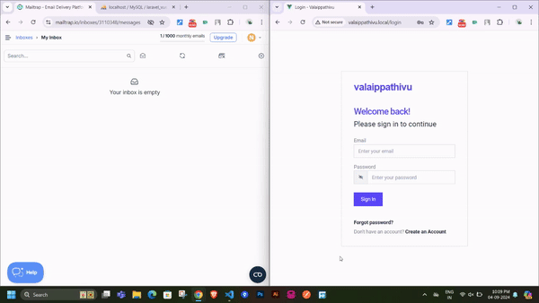

## Laravel 10 & Vue 3 Authentication Project

This project is a web application built with Laravel 10 for the backend and Vue 3 for the frontend. It implements user authentication with a focus on security and performance. Key features include OTP (One-Time Password) verification for user registration and password recovery, as well as email queue jobs to improve performance.



[Watch the video](https://tinyurl.com/26j79vee)

## Features

-   **OTP Verification**: Secure user registration and password recovery using OTPs sent via email.
-   **Email Queue Jobs**: Utilizes Laravel's queue system to handle email sending asynchronously, improving application performance and responsiveness.
-   **User Authentication**: Includes standard user authentication flows such as login, registration, and password reset.

### Installation and Setup

1. Clone the repository to your local machine:

    ```bash
    git clone https://github.com/rajkumar-ravichandiran/laravel-vue-authentication.git
    ```

2. Navigate to the project directory:

    ```bash
    cd laravel-vue-authentication
    ```

3. Install the dependencies using Composer:

    ```bash
    composer install
    ```

4. Copy the `.env.example` file and rename it to `.env`. Update the database credentials in the `.env` file to match your environment.

5. Generate an application key:

    ```bash
    php artisan key:generate
    ```

6. Run the database migrations to create the necessary tables:

    ```bash
    php artisan migrate

    ```

7. Configure Mail Queue Set up the mail queue driver in your .env file (e.g., use database or redis):

    ```bash
    QUEUE_CONNECTION=database
    ```

8. Start the Development Server Run the Laravel development server:

    ```bash
    php artisan serve
    ```

    In a separate terminal, start the Vue development server:

    ```bash
    npm run dev
    ```

9. Run Queue Worker Start the queue worker to process email jobs:
    ```bash
    php artisan queue:work
    ```

### Usage

1. Registration: Users can sign up by entering their email. An OTP will be sent to their email for verification.

2. Login: Registered users can log in using their email and password.

3. Password Recovery: Users can reset their password by requesting an OTP to be sent to their email.

### Contributing

Contributions to this project are welcome. If you have any suggestions, improvements, or bug fixes, feel free to open a pull request.
